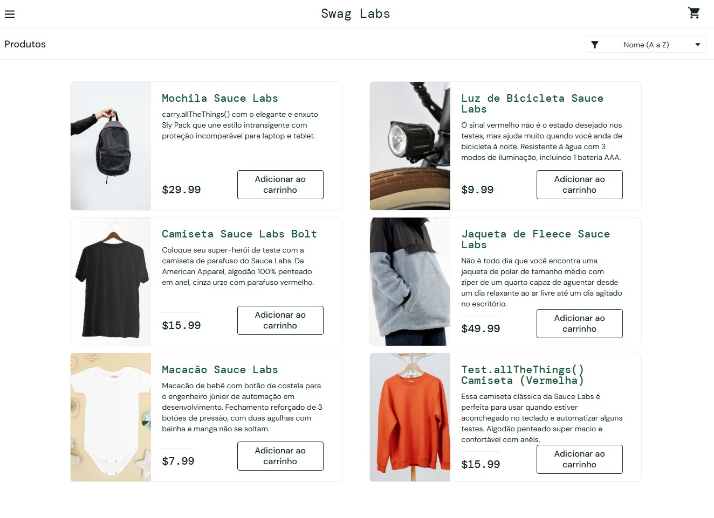
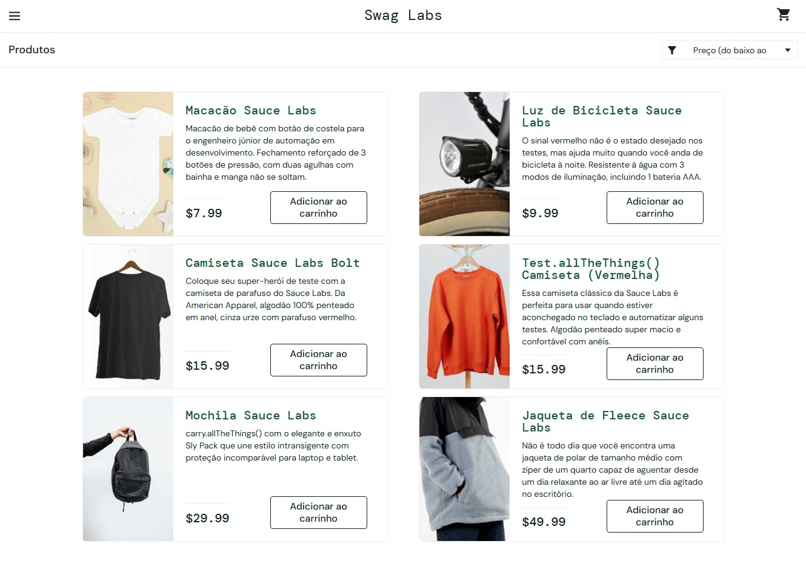
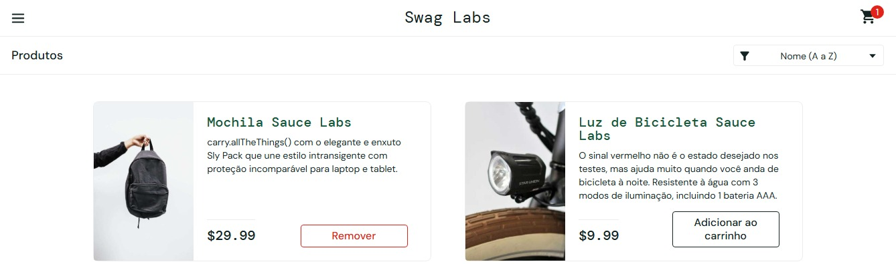

# Projeto 01 — Testes Manuais de uma aplicação E-commerce | SauceDemo

Projeto de testes manuais realizado na aplicação de demonstração SauceDemo, com foco na validação das principais funcionalidades de uma aplicação de e-commerce.

## Sobre o projeto

Este projeto foi desenvolvido com o objetivo de praticar e demonstrar conhecimentos em testes de software, utilizando uma aplicação de e-commerce de demonstração.
Durante a execução, foram realizados testes manuais para validar funcionalidades relacionadas ao login, catálogo de produtos, ordenação, carrinho de compras, checkout e logout.

## Objetivo

O objetivo deste projeto é aplicar conceitos de testes manuais na prática, incluindo:

- Planejamento de testes;
- Criação de casos de teste;
- Execução dos testes;
- Identificação de falhas;
- Registro e documentação de bugs;
- Análise dos resultados;
- Organização de evidências.

  ## Aplicação testada

**Aplicação:** SauceDemo

**Tipo:** Aplicação web de demonstração de e-commerce

**URL:** https://www.saucedemo.com/

A aplicação foi utilizada como ambiente de prática para execução dos testes manuais.

## Escopo dos testes

Foram avaliadas as seguintes funcionalidades:

- Login com usuário válido;
- Login com usuário bloqueado;
- Exibição dos produtos;
- Ordenação dos produtos por preço;
- Adição de produtos ao carrinho;
- Remoção de produtos do carrinho;
- Validação do formulário de checkout;
- Fluxo de checkout;
- Logout.

  ## Casos de teste

Foram elaborados e executados 9 casos de teste:

| ID | Módulo | Descrição | Status |
|---|---|---|
| TC-001 | Login | Login com usuário válido | ✅ PASSOU |
| TC-002 | Login | Login com usuário bloqueado | ✅ PASSOU |
| TC-003 | Produtos | Exibição dos produtos | ✅ PASSOU |
| TC-004 | Produtos | Ordenação por preço | ✅ PASSOU |
| TC-005 | Carrinho | Adicionar produto ao carrinho | ✅ PASSOU |
| TC-006 | Carrinho | Remover produto do carrinho | ✅ PASSOU |
| TC-007 | Checkout | Enviar formulário vazio | ❌ FALHOU |
| TC-008 | Checkout | Finalizar compra | ❌ FALHOU |
| TC-009 | Logout | Encerrar sessão | ✅ PASSOU |

## Resultado da execução

| Indicador | Resultado |
|---|---:|
| Total de casos de teste | 9 |
| Testes aprovados | 7 |
| Testes reprovados | 2 |
| Testes bloqueados | 0 |
| Taxa de aprovação | 80% |
| Bugs encontrados | 2 |

### Resumo

Foram executados 9 casos de teste. Desses, 7 foram aprovados e 2 foram reprovados, resultando em uma taxa de aprovação de 80%.
As duas falhas identificadas ocorreram no fluxo de Checkout e foram registradas nos Bug Reports BUG-001 e BUG-002.

## Bugs encontrados

Durante a execução dos testes foram identificados 2 bugs relacionados ao fluxo de Checkout.

### BUG-001 — Tela em branco ao enviar formulário de checkout sem preencher os campos obrigatórios

**Severidade:** Alta  
**Prioridade:** Alta

Ao tentar avançar no checkout sem preencher os campos obrigatórios, o sistema apresenta uma tela em branco em vez de informar ao usuário quais campos precisam ser preenchidos.

### BUG-002 — Tela em branco ao avançar para o resumo do pedido durante o checkout

**Severidade:** Alta  
**Prioridade:** Alta

Após preencher corretamente os dados do checkout e clicar em "Continue", o sistema apresenta uma tela em branco e não exibe o resumo do pedido.

## Evidências

As evidências foram coletadas durante a execução dos casos de teste e utilizadas para comprovar os resultados obtidos.

### TC-001 — Login com usuário válido

Teste realizado para validar o acesso à aplicação utilizando credenciais válidas.

### TC-002 — Login com usuário bloqueado

Teste realizado para validar o comportamento da aplicação ao tentar acessar o sistema com um usuário bloqueado.

### TC-003 — Exibição dos produtos

Teste realizado para verificar se os produtos são apresentados corretamente após o login.

### TC-004 — Ordenação dos produtos por preço

Teste realizado para validar a ordenação dos produtos utilizando a opção de preço do menor para o maior.

### TC-005 — Adicionar produto ao carrinho

Teste realizado para validar a inclusão de um produto no carrinho de compras.

### BUG-001 — Tela em branco ao enviar formulário de checkout vazio

Durante a execução do TC-007, foi identificada uma falha ao tentar avançar no checkout sem preencher os campos obrigatórios.

**Resultado obtido:** a aplicação apresenta uma tela completamente branca e não exibe uma mensagem de validação.

### BUG-002 — Tela em branco ao avançar para o resumo do pedido

Durante a execução do TC-008, foi identificada uma falha ao tentar avançar para o resumo do pedido após o preenchimento dos dados do checkout.

**Resultado obtido:** a aplicação apresenta uma tela completamente branca e não exibe o resumo do pedido.

## Ferramentas e conhecimentos utilizados

- Testes manuais;
- Casos de teste;
- Cenários de teste;
- Identificação e documentação de bugs;
- Testes funcionais;
- Validação de funcionalidades;
- Análise de resultados;
- Documentação de testes;
- GitHub;
- Markdown.

  ## Ambiente de teste

- **Aplicação:** SauceDemo
- **Plataforma:** Web/Desktop
- **Navegador:** Google Chrome
- **Sistema operacional:** Windows

  ## Conclusão

O projeto permitiu aplicar na prática conceitos fundamentais de testes de software, desde o planejamento e criação dos casos de teste até a execução, identificação de falhas e documentação dos bugs encontrados.
Os testes apresentaram uma taxa de aprovação de 80%, com duas falhas identificadas no fluxo de Checkout. Os problemas encontrados foram documentados e acompanhados por evidências.

## Autora

**Jhenifer Machado**

Estudante de Análise e Desenvolvimento de Sistemas, com foco em Qualidade de Software (QA) e testes.

